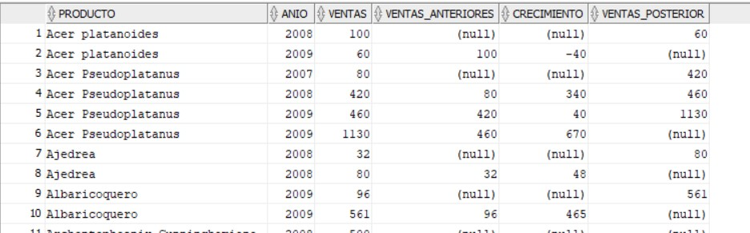
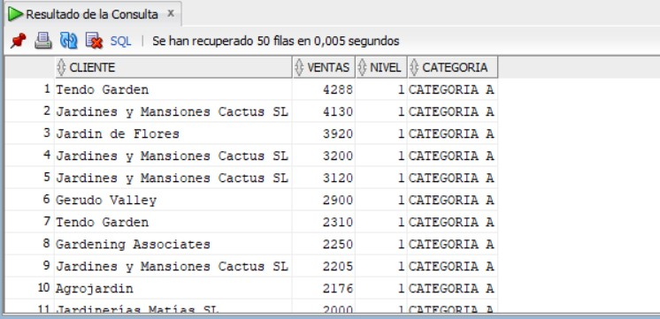
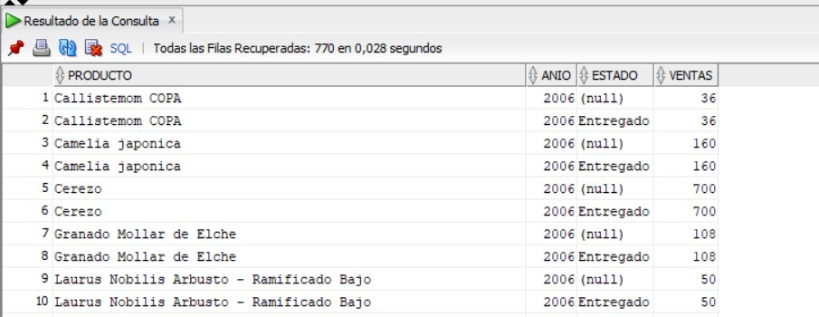

# Clase 03

## En esta clase vimos unas consultas sql mas avanzadas con jardineria, y ejecutamos las ejecutamos y vimos el resultado

## scritps de las consultas.

### [ Consultas_avanzadas_jardineria ](archivos/Consultas_Jardineria.txt)

## Resultado consulta 1

### 

## Resultado consulta 2

### 

## Resultado consulta 3

### 